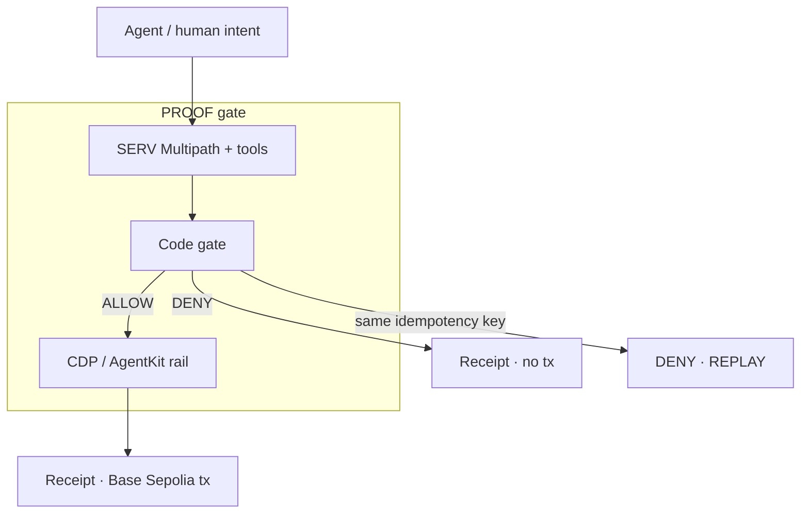
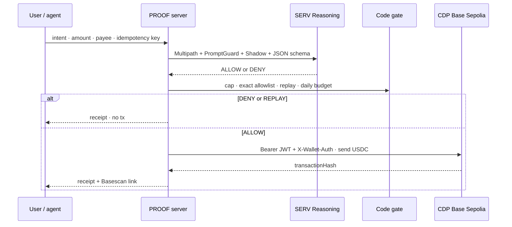
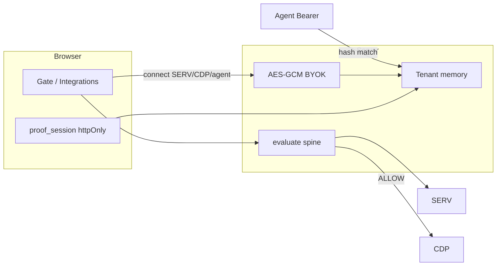

<p align="center">
  <a href="https://proof-smoky.vercel.app">
    
  </a>
</p>

<p align="center">
  
</p>

<p align="center">
  <a href="https://proof-smoky.vercel.app"></a>
  <a href="https://www.openserv.ai/hackathon"></a>
  <a href="https://github.com/henrysammarfo/proof"></a>
</p>

<p align="center">
  
  
  
  
  
</p>

---

## Project description and overview

**PROOF** is a fail-closed spend gate for AI agents — an all-around desk, not a one-shot demo.

Agents are getting wallets. Wallets move money. The scary part is not “can the model think?” — it is “can the same invoice get paid twice?” and “can a bad payee slip past a chatty policy?”

PROOF sits in front of Coinbase AgentKit / CDP transfers on **Base Sepolia**. SERV Reasoning reads the policy. A deterministic code gate double-checks the numbers. Only then does money move. Every decision leaves a receipt: rule, shadow, latency, tokens, and a Basescan link when a transfer happened.

Judges and operators each get a **signed httpOnly workspace**. Connect your own SERV key, CDP wallet, and agent Bearer on `/integrations` — or fall back to the shared demo env when the operator armed it. Log out / new workspace resets the cookie. No localStorage receipts. No keys in the browser bundle.

> Soft pitch we use everywhere: **Your agent cannot move money until SERV proves the policy passed — including a second try of the same payment.**

We never invent ALLOW. We never invent a transaction hash. Missing keys fail closed and stay labeled. This is testnet. Not financial advice. Not “unhackable.”

**Live product:** https://proof-smoky.vercel.app  
**Hackathon:** [OpenServ SERV Edition 01 · AgentKit track](https://www.openserv.ai/hackathon) · submit by **28 Sep 2026 00:00 UTC**  
**Flaws ledger:** [`docs/memory/FLAWS_AND_WORKAROUNDS.md`](docs/memory/FLAWS_AND_WORKAROUNDS.md) · Competitor notes: [`docs/memory/COMPETITORS.md`](docs/memory/COMPETITORS.md)

---

## Why judges can score this cleanly

| Score lens | What is live | Where to click |
| :--- | :--- | :--- |
| **Creativity** | Dual proof (SERV + code), replay DENY, daily budget, BYOK agent HTTP | `/gate` · `/integrations` · `/api/v1/evaluate` |
| **User-readiness** | Soft sentence, Deny → Allow → Replay, own-keys workspace, Basescan | `/gate` · `/receipts` · `/integrations` |
| **Revenue** | Agent-ops gate — other agents call evaluate with a Bearer keyed to a tenant | Integrations · Settings |

Doctrine on every path: fail closed, no mocks, no silent greens, no fake hashes, IXS/RH parked until verified.



---

## How deep we went (technical novelty)

This is the part that separates a paste-demo from a load-bearing AgentKit track entry.

### 1. SERV is not “chat with a base URL”

| Mechanism | What we actually send | Why it is load-bearing |
| :--- | :--- | :--- |
| **Multipath** model id (`*-serv-multipath`) | Branching spend policy without hand-rolled trees | Track feature, not a label |
| **`serv_prompt_guard`** | Declared tool on every evaluate + review | Opt-in anti-injection on the system prompt |
| **`serv_shadow_agent`** | Declared with a **hint** that encodes cap + allowlist criteria | Validation loop criteria text (OpenServ docs) — not a numeric enforcer |
| **Strict `json_schema`** | Every property in `required` (OpenAI-compat quirk) | Machine-checkable ALLOW/DENY; refuse → fail closed |
| **Policy in user JSON** | Caps live in the user payload, not only system prose | Workaround for Multipath content_filter eating long system policies |

Binding correction from live OpenServ docs: Shadow `hint` is **validation criteria text**. Caps, allowlist, and replay stay in **server code** after SERV answers. Multipath does **not** authorize chain side effects.

### 2. AgentKit / CDP without the SDK that breaks Workers

The official `@coinbase/agentkit` tree dragged Solana / WalletConnect into the Nitro / workerd bundle and died. We rebuilt the **same credential surface** as a Cloudflare-safe rail:

1. **Ed25519 / ES256 Bearer JWT** (`jose`) — proves CDP project ownership (`sub` = API key id, `uri` bound to method+host+path).
2. **`X-Wallet-Auth` JWT** — wallet secret signs `reqHash = sha256(canonical JSON body)` for send.
3. **`viem` EIP-1559** — encode USDC `transfer(to, amount)` calldata on Base Sepolia (`84532`), serialize, POST `/platform/v2/evm/accounts/{from}/send/transaction`.
4. **Fail closed** if `transactionHash` is missing or malformed — never invent a hash.

That is AgentKit-track money movement with real CDP secrets, without shipping a dead worker.

### 3. Dual proof + exact allowlist + replay DENY



- SERV can ALLOW and code gate still DENY (`OVER_CAP`, `PAYEE_NOT_ALLOWLISTED`, `DAILY_BUDGET_EXCEEDED`).
- Same idempotency key → fresh **DENY · REPLAY** receipt (we used to wrongly re-show the prior ALLOW — fixed).
- Allowlist is **exact** `0x` + 40 hex. Prefix / substring tricks fail.

### 4. Multi-tenant safety + BYOK access model

| Layer | Mechanism | Access rule |
| :--- | :--- | :--- |
| Browser workspace | HMAC-signed `proof_session` httpOnly cookie | Receipts/policies isolated per session |
| Tenant BYOK | AES-256-GCM sealed with `SESSION_SECRET` | SERV / CDP secrets never returned to client |
| Agent HTTP | SHA-256 of Bearer → tenant map | Your agent key → your receipts; shared env key → `ten_agent_http` |
| Rate limits | In-memory per tenant id | UI 40/min · agent 60/min (per-instance honesty) |
| Spam | Honeypot + CSRF on evaluate UI | Silent drop if honeypot filled |
| Consent | `proof_consent` | Analytics beacon only after Accept |



**How a judge tries their own stack:** open `/integrations` → paste SERV key → paste CDP id/secret/wallet/address → generate a ≥16-char agent Bearer → `curl` `/api/v1/evaluate` with that Bearer. Log out / new workspace on Settings or Integrations clears the cookie and sealed keys for that browser.

### 5. Bugs we found that were real (and fixed)

Full table: [`docs/memory/FLAWS_AND_WORKAROUNDS.md`](docs/memory/FLAWS_AND_WORKAROUNDS.md).

Highlights worth judging on:

- **Navbar pill “mystery” right-align** — CSS animation `translate: 0 0` (fill-mode both) overwrote centering `translate: -50%`. Fixed by centering with inset + margin so motion cannot steal X.
- **Replay looked like double-ALLOW** — fixed to DENY · REPLAY.
- **Substring allowlist** — fixed to exact address equality.
- **AgentKit SDK killed the worker** — jose + viem REST rail.
- **SERV content_filter** — policy moved into user JSON; refusals fail closed.
- **Shared agent tenant collision** — BYOK agent key hashes to an isolated workspace.

---

## Technology stack

| Layer | Tools | Role on PROOF |
| :--- | :--- | :--- |
| Desk UI | TanStack Start, React, Vite, TypeScript | Gate, receipts, policies, review, integrations, settings |
| Sessions | Signed httpOnly cookies (HMAC) | Multi-tenant without localStorage receipts |
| BYOK | AES-256-GCM + SHA-256 agent hashes | Bring-your-own SERV / CDP / agent Bearer |
| Reasoning | OpenServ SERV OpenAI-compatible API | Multipath + Shadow + PromptGuard |
| Spend rail | Coinbase CDP REST · Base Sepolia USDC | Transfer only after ALLOW |
| Honesty | Code gate, network matrix, parked IXS/RH | No invented greens |

---

## How the desk flows

Demo order we say out loud: Soft → Deny on camera → Why SERV → Live AgentKit tx → Receipt → Who pays → (optional) Connect your keys.

```mermaid
flowchart TD
  L[Landing] --> G[/gate]
  G --> D[Load $50 deny]
  D --> R1[DENY receipt · no tx]
  G --> A[Load $1 allow]
  A --> Tx[Base Sepolia USDC tx]
  Tx --> R2[ALLOW receipt + Basescan]
  G --> P[Load replay]
  P --> R3[DENY · REPLAY]
  G --> Int[/integrations]
  Int --> BYOK[Connect own SERV / CDP / agent]
  BYOK --> Agent[POST /api/v1/evaluate]
```

### Two-minute demo

1. Soft sentence.
2. **Load $50 deny** → Prove → DENY, rule e.g. `OVER_CAP`, no tx.
3. **Load $1 allow** → Prove → ALLOW → Basescan link on the receipt.
4. **Load replay** → Prove → DENY · `REPLAY`.
5. Optional: Integrations → connect your SERV key → Review or Gate with your quota.
6. Honesty: Base Sepolia · not financial advice · no “unhackable.”

---

## Core capabilities

1. **Policy proof before money** — SERV decides; code gate can still DENY; CDP never runs on DENY.
2. **Replay protection** — same idempotency key cannot spend twice.
3. **Daily budget** — optional UTC day ceiling on top of per-transfer cap.
4. **Exact allowlist** — full `0x` only.
5. **Live AgentKit-track transfers** — real CDP credentials, real Base Sepolia USDC. Example smoke tx: https://sepolia.basescan.org/tx/0xd38a39f60caf2854d5bfe6dc87098fe58c289ca00024f10f17c5cb2fab6743f3
6. **Agent HTTP API** (tenant BYOK or shared env):

```bash
curl -sS https://proof-smoky.vercel.app/api/v1/evaluate \
  -H "Authorization: Bearer $YOUR_AGENT_OR_PROOF_AGENT_API_KEY" \
  -H "Content-Type: application/json" \
  -d '{"amountUsd":1,"recipient":"0xE2891FC6511652EE73A8B7Acda66e7a3fFA24b3C","intent":"agent payout","idempotencyKey":"agent-demo-001"}'
```

7. **Policy risk review** — `/review` live SERV structured risk analysis.
8. **Bring-your-own keys** — `/integrations` seals SERV + CDP; hashes agent Bearer; env is shared fallback for the public demo.
9. **Launch surface** — privacy/terms, HSTS, cookie consent, OG/sitemap, honeypot + rate limit, custom 404, single CTA.

---

## Accounts on the live demo (public shared env)

| Role | Address |
| :--- | :--- |
| Spender (`proof-spender`) | `0xE4489256De809eE14BFEbD30461Ea47075f3e2FA` |
| Payee (`proof-payee`, allowlisted) | `0xE2891FC6511652EE73A8B7Acda66e7a3fFA24b3C` |

When you connect **your** CDP address on Integrations, that spender is used for your tenant instead.

---

## Local setup · tests

```bash
cp .env.example .env
# fill SERV_API_KEY, SESSION_SECRET, CDP_* — see docs/memory/KEYS_SETUP.md and CDP_SETUP.md
npm install
npm run dev
npm run test:gate      # code-gate unit
npm run test:stress    # 1000+ gate checks (cap/allowlist/replay/budget/prefix)
npm run check:launch   # live routes on production
npm run test:all       # gate + stress + launch
npm run smoke:full     # needs live keys — DENY → ALLOW+tx → REPLAY
```

Never commit `.env`. Rotate anything pasted in chat after the hack.

Honest serverless limit: idempotency + BYOK seals are **per-instance memory**. A Durable ledger is phase-2 and labeled as such.

---

## Submit checklist

See [`docs/memory/WIN_CHECKLIST.md`](docs/memory/WIN_CHECKLIST.md).

1. Org **data collection ON** at https://console.openserv.ai/settings/organization
2. Public X post · tag **@openservai** · name, concept, images, github, live demo
3. Official form after the post · https://www.openserv.ai/hackathon
4. Deadline **28 Sep 2026 00:00 UTC**

---

Built for builders who need a brake, not another chat window.
