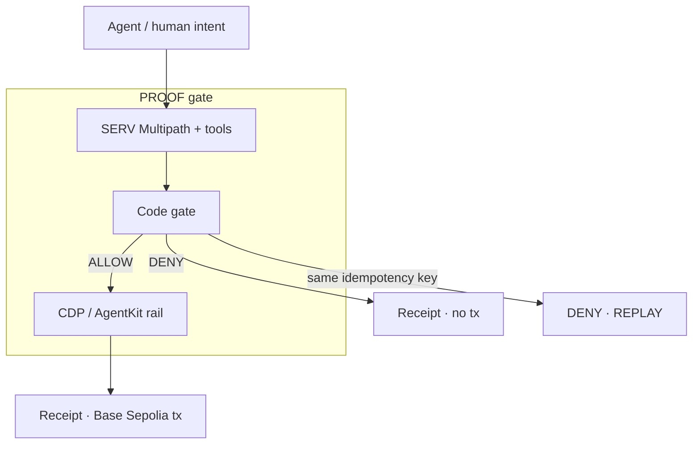
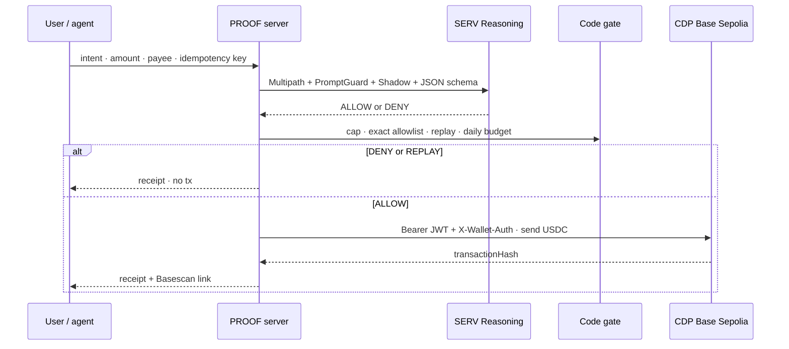
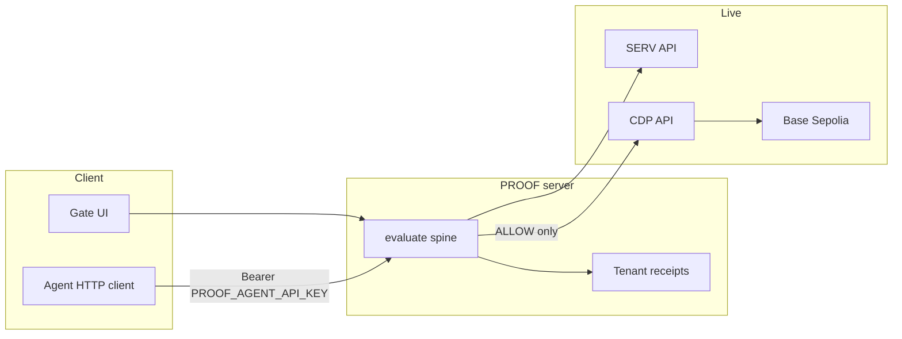

<p align="center">
  <a href="https://proof-smoky.vercel.app">
    
  </a>
</p>

<p align="center">
  
</p>

<p align="center">
  <a href="https://proof-smoky.vercel.app"></a>
  <a href="https://www.openserv.ai/hackathon"></a>
  <a href="https://github.com/henrysammarfo/proof"></a>
</p>

<p align="center">
  
  
  
  
</p>

---

## Project description and overview

**PROOF** is a fail-closed spend gate for AI agents.

Agents are getting wallets. Wallets move money. The scary part is not “can the model think?” — it is “can the same invoice get paid twice?” and “can a bad payee slip past a chatty policy?”

PROOF sits in front of Coinbase AgentKit / CDP transfers on **Base Sepolia**. SERV Reasoning reads the policy. A deterministic code gate double-checks the numbers. Only then does money move. Every decision leaves a receipt: rule, shadow, latency, tokens, and a Basescan link when a transfer happened.

> Soft pitch we use everywhere: **Your agent cannot move money until SERV proves the policy passed — including a second try of the same payment.**

We never invent ALLOW. We never invent a transaction hash. Missing keys fail closed and stay labeled. This is testnet. Not financial advice. Not “unhackable.”

**Live product:** https://proof-smoky.vercel.app  
**Hackathon:** [OpenServ SERV Edition 01 · AgentKit track](https://www.openserv.ai/hackathon) · submit by **28 Sep 2026 00:00 UTC**  
**Flaws ledger:** [`docs/memory/FLAWS_AND_WORKAROUNDS.md`](docs/memory/FLAWS_AND_WORKAROUNDS.md) · Competitor notes: [`docs/memory/COMPETITORS.md`](docs/memory/COMPETITORS.md)

---

## Why judges can score this cleanly

| Score lens         | What is live                                                               | Where to click               |
| :----------------- | :------------------------------------------------------------------------- | :--------------------------- |
| **Creativity**     | Dual proof (SERV + code), replay DENY, daily budget, agent HTTP API        | `/gate` · `/api/v1/evaluate` |
| **User-readiness** | Soft sentence, Deny → Allow → Replay presets, Basescan receipt links       | `/gate` · `/receipts`        |
| **Revenue**        | Agent-ops gate as a product — other agents call evaluate with a Bearer key | Integrations · Settings      |

Doctrine on every path: fail closed, no mocks, no silent greens, no fake hashes, IXS/RH parked until verified.



---

## How SERV and AgentKit are load-bearing

This is not “paste a base URL into OpenAI.” The spine uses the features OpenServ is asking builders to show.

| SDK / API                               | How PROOF uses it                             | Why it matters                                    |
| :-------------------------------------- | :-------------------------------------------- | :------------------------------------------------ |
| **SERV Multipath** (`*-serv-multipath`) | Branching spend policy in the model ID        | Policy trees without hand-rolled prompt spaghetti |
| **`serv_shadow_agent`**                 | Declared on every evaluate/review with a hint | Validation loop criteria for ALLOW/DENY quality   |
| **`serv_prompt_guard`**                 | Declared on every evaluate/review             | Opt-in anti-injection for the system prompt       |
| **Structured JSON schema**              | Strict ALLOW/DENY + reason                    | Machine-checkable decision, not free prose        |
| **CDP Secret API Key**                  | Ed25519 Bearer JWT (`jose`)                   | Proves project ownership to CDP REST              |
| **CDP Wallet Secret**                   | `X-Wallet-Auth` JWT + `reqHash`               | Required for wallet writes / send                 |
| **CDP send/transaction**                | `viem` EIP-1559 USDC calldata on Base Sepolia | Real AgentKit-track money movement                |



Binding correction from live OpenServ docs: Shadow `hint` is **validation criteria text**, not a numeric enforcer. Caps, allowlist, and replay stay in **server code** after SERV answers. Multipath does not authorize chain side effects.

---

## Flaws we found · and how we lived with them

Full table: [`docs/memory/FLAWS_AND_WORKAROUNDS.md`](docs/memory/FLAWS_AND_WORKAROUNDS.md).

Highlights:

- Replay used to re-show the old ALLOW — fixed to a fresh **DENY · REPLAY** receipt.
- Allowlist used substring matching — fixed to **exact** `0x` addresses.
- Heavy CDP AgentKit SDK broke the Cloudflare / Nitro worker — replaced with a **jose + viem REST rail** that still uses real CDP credentials.
- SERV content filter ate structured policies when caps lived only in the system prompt — policy now rides in the **user JSON**.

---

## Technology stack

| Layer      | Tools                                    | Role on PROOF                                  |
| :--------- | :--------------------------------------- | :--------------------------------------------- |
| Desk UI    | TanStack Start, React, Vite, TypeScript  | Gate, receipts, policies, review, integrations |
| Sessions   | Signed httpOnly cookies (HMAC)           | Multi-tenant without localStorage receipts     |
| Reasoning  | OpenServ SERV OpenAI-compatible API      | Multipath + Shadow + PromptGuard               |
| Spend rail | Coinbase CDP REST · Base Sepolia USDC    | Transfer only after ALLOW                      |
| Honesty    | Code gate, network matrix, parked IXS/RH | No invented greens                             |



---

## How the desk flows

Demo order we say out loud: Soft → Deny on camera → Why SERV → Live AgentKit tx → Receipt → Who pays.

```mermaid
flowchart TD
  L[Landing] --> G[/gate]
  G --> D[Load $50 deny]
  D --> R1[DENY receipt · no tx]
  G --> A[Load $1 allow]
  A --> Tx[Base Sepolia USDC tx]
  Tx --> R2[ALLOW receipt + Basescan]
  G --> P[Load replay]
  P --> R3[DENY · REPLAY]
  G --> Rec[/receipts]
  G --> Pol[/policies]
  G --> Rev[/review]
  G --> Int[/integrations]
```

### Two-minute demo

1. Soft sentence.
2. **Load $50 deny** → Prove → DENY, rule e.g. `OVER_CAP`, no tx.
3. **Load $1 allow** → Prove → ALLOW → Basescan link on the receipt.
4. **Load replay** → Prove → DENY · `REPLAY`.
5. Honesty: Base Sepolia · not financial advice · no “unhackable.”

---

## Core capabilities

### 1. Policy proof before money

SERV decides. Code gate can still DENY. CDP never runs on DENY.

### 2. Replay protection

Same idempotency key cannot spend twice. The second try gets its own DENY receipt.

### 3. Daily budget

Optional rolling UTC day ceiling on top of the per-transfer cap.

### 4. Exact allowlist

Full `0x` addresses only. Prefix tricks do not pass.

### 5. Live AgentKit-track transfers

Real CDP credentials, real Base Sepolia USDC. Example smoke tx:  
https://sepolia.basescan.org/tx/0xd38a39f60caf2854d5bfe6dc87098fe58c289ca00024f10f17c5cb2fab6743f3

### 6. Agent HTTP API

```bash
curl -sS https://proof-smoky.vercel.app/api/v1/evaluate \
  -H "Authorization: Bearer $PROOF_AGENT_API_KEY" \
  -H "Content-Type: application/json" \
  -d '{"amountUsd":1,"recipient":"0xE2891FC6511652EE73A8B7Acda66e7a3fFA24b3C","intent":"agent payout","idempotencyKey":"agent-demo-001"}'
```

### 7. Policy risk review

`/review` runs live SERV structured risk analysis — fail closed without a key.

---

## Accounts on the live demo (public)

| Role                               | Address                                      |
| :--------------------------------- | :------------------------------------------- |
| Spender (`proof-spender`)          | `0xE4489256De809eE14BFEbD30461Ea47075f3e2FA` |
| Payee (`proof-payee`, allowlisted) | `0xE2891FC6511652EE73A8B7Acda66e7a3fFA24b3C` |

---

## Local setup

```bash
cp .env.example .env
# fill SERV_API_KEY, SESSION_SECRET, CDP_* — see docs/memory/KEYS_SETUP.md and CDP_SETUP.md
npm install
npm run dev
npm run test:gate
npm run smoke:full   # needs live keys
```

Never commit `.env`. Rotate anything pasted in chat after the hack.

---

## Submit checklist

See [`docs/memory/WIN_CHECKLIST.md`](docs/memory/WIN_CHECKLIST.md).

1. Org **data collection ON** at https://console.openserv.ai/settings/organization
2. Public X post · tag **@openservai** · name, concept, images, github, live demo
3. Official form after the post · https://www.openserv.ai/hackathon
4. Deadline **28 Sep 2026 00:00 UTC**

---

Built for builders who need a brake, not another chat window.
